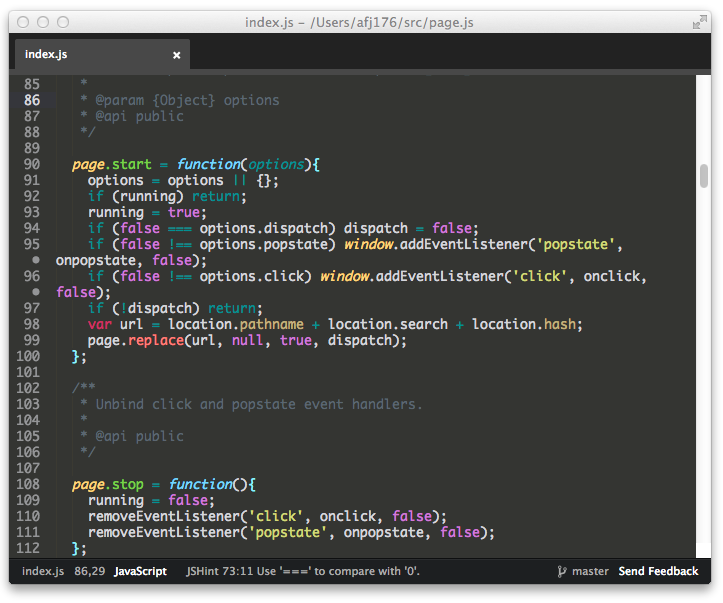

#Aethusa

***Daughter of Poseidon | Theme of bosses***

Atom.io Theme based on [Deep Blue See](https://github.com/jisaacks/DeepBlueSee/) by [JD Isaacks](https://github.com/jisaacks)



##Installing

1. Go to `Atom -> Preferences...`
2. Then select the `Themes` tab
3. Enter `Aethusa` in the search box

#### Install using Git

Alternatively, if you are a git user, you can install the theme and keep up to date by cloning the repo directly into your `~/.atom/packages` directory.

```sh
$ git clone https://github.com/afj176/Aethusa-atom/ ~/.atom/packages/Aethusa-atom
```

#### Download Manually

1. Download the files using the [GitHub .zip download](https://github.com/afj176/Aethusa-atom/archive/master.zip) option and unzip them
3. Move the `Aethusa-atom` folder to `~/.atom/packages`

#### Activating the theme

Go to `Atom -> Preferences...`, click in the `Themes` tab, and select `Aethusa` in the `Syntax Theme` dropdown.


If you're a Textmate/Sublime User, see:

[Aethusa-tmTheme](https://github.com/afj176/Aethusa-tmTheme)

If you're a Vim User, see:

[Aethusa-vim](https://github.com/afj176/Aethusa-vim)